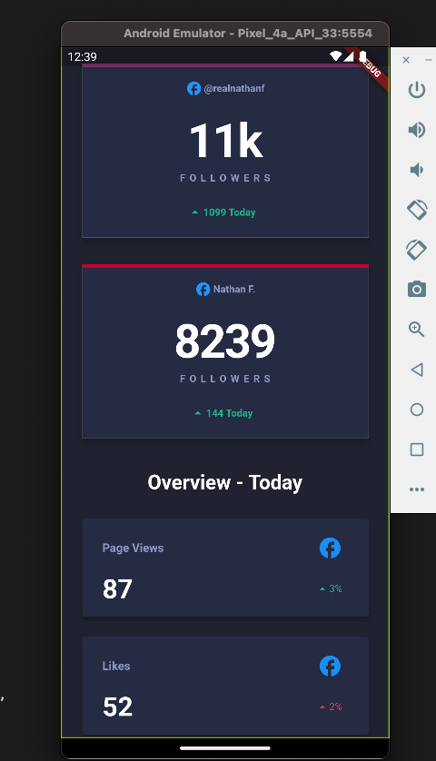

# Social Media Dashboard UI with Flutter

### Components

1. Main Components which will include header, dark mode button and overview text
2. Card Component for followers for each Social Media
3. Card Component for pages view and likes 
4. Icons could inserted as seperate component but only src change.

### Data

1. Static Data, use string to represent it.

### Components Design

A new Flutter project.

# Getting Started

1. `flutter run`
2. select chromeos for web, since app is built for web for v1

# v1 

